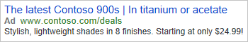
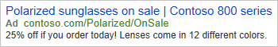

# Ad Customizer Feeds
> [!NOTE]
> The Bulk API for feeds and documentation are subject to change.

With ad customizers, your ads can dynamically update themselves to appeal to specific customers. All it takes is uploading an ad customizer feed that tells us what information you want to insert into your ads under which circumstances.

Why use ad customizer feeds?
- Save time. Transform a single ad into hundreds of variations without having to manually update the ad.  
- More relevant ads. Customize ads based on what customers are searching for, when they're searching for it, where they are, what device they're using, and more.  
- Better results. See higher click-through and conversion rates.  

## How ad customizer feeds work
You can upload ad customizer feeds and feed items with the Bulk service. 
- The [Feed](../bulk-service/feed.md) record defines the name and data type of custom attributes that are allowed for the corresponding feed items. 
- The [Feed Item](../bulk-service/feed-item.md) record defines additional information about your products or services and under what conditions that information should be inserted into your ads. The Microsoft Advertising system attributes define under what conditions each feed item should be inserted into your ads, whereas the custom attributes define what information about your products or services you want to insert into your ads. Your ad customizer feed items can be referenced from all ads in your Microsoft Advertising account by default. Optionally you can restrict each feed item to a specific campaign or ad group.  

## See Also
[Expanded Text Ads](expanded-text-ads.md)  
